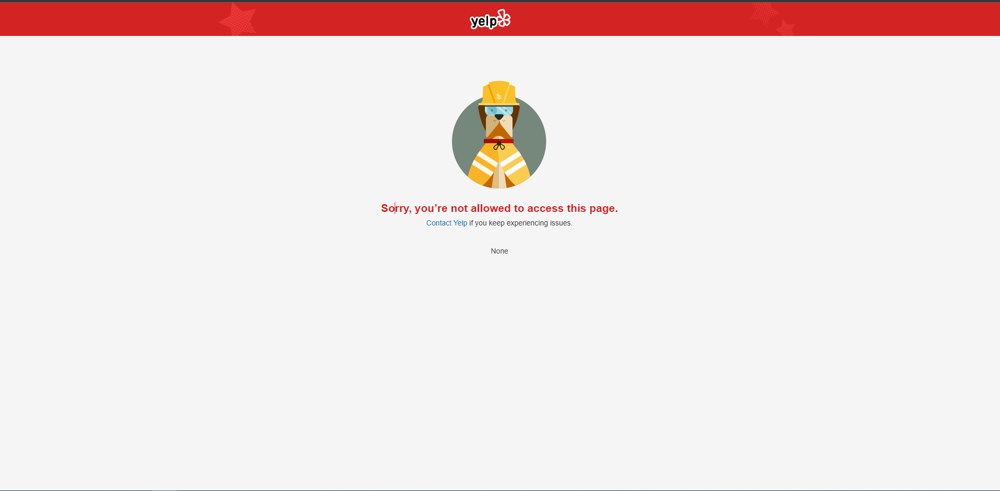
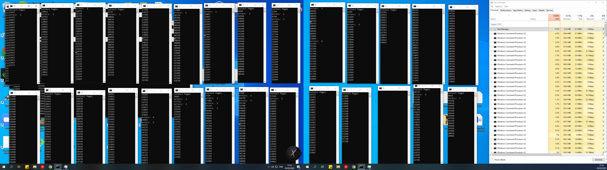

# The Root Of Data Science

# Images

# Conclusions
* First first of all web scraping is fun!

## Web scraping
* Need (Cache System) save the requests content in files per url, 
  so next time we will load the content from the file and not from requests.get

* To find custom key (business Name) for every row in any table, for removing duplicates, 

We got 27K businesses from 87K requests becase of that

## Classification Model (Has Expensive Level)

## Registration Model (Expensive Level)

# Authors
* Lior Shiboli
* Omer Priel